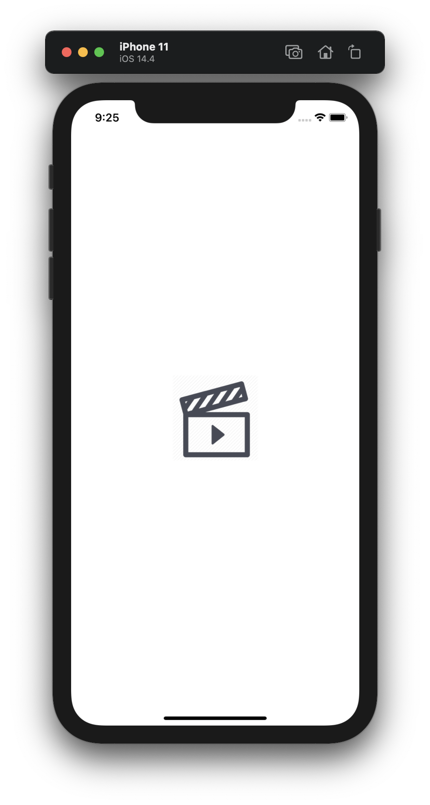
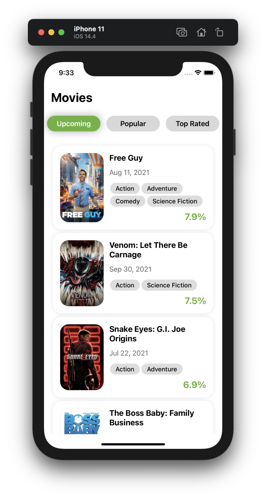
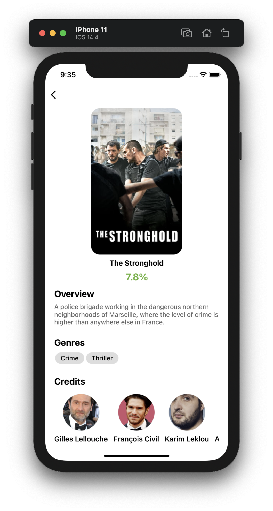

## Project Overview

Discover Movies and TV shows

   
## Screenshots
<kbd></kbd>
<kbd></kbd>
<kbd></kbd>

## Installation

```sh
  git clone https://github.com/MahmoudAziz1996/movies-app-assignment
  
  npm install or yarn install
  
  npm start
```
## Run on Android

```
react-native run-android
```

## Run on iOS

```
 cd ios & pod install
 cd ..
 react-native run-ios
```
create-react-native-app
--------

This project was bootstrapped with [Create React Native App](https://github.com/react-community/create-react-native-app).

## Features

- React Native
- TypeScript
- React Navigation v6
- skeleton-placeholder for (shimmer effect)
- Redux
- Redux-thunk
- Redux-persist
- Axios
